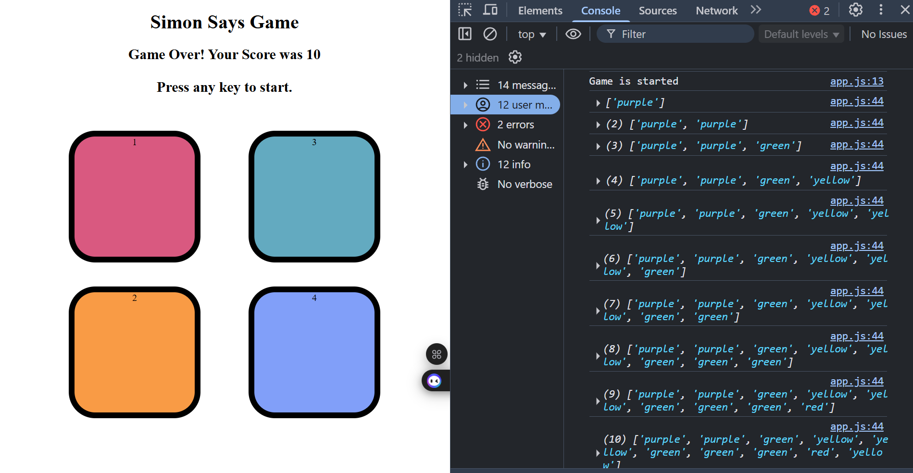

# 🎮 Simon Says Game 🟩🟥🟨🟪

A fun memory-based game where players must repeat an increasing sequence of colors! Inspired by the classic Simon Says, this game tests your pattern recognition and reflexes.

## 🚀 Features  
✅ **Dynamic Levels** – The game gets harder as you progress!  
✅ **Smooth Animations** – Flashing effects for both game and user interactions.  
✅ **Responsive Design** – Works across all screen sizes.  
✅ **JavaScript-Powered Logic** – Fully implemented in vanilla HTML, CSS, and JavaScript.  
✅ **Instant Feedback** – White flash for game sequence, green flash for user input.  

## 🎮 How to Play?  
1️⃣ Press any key to start the game.  
2️⃣ Watch carefully as the game flashes a sequence of colors.  
3️⃣ Click the buttons in the same order as shown.  
4️⃣ Get it right? 🎉 Move to the next level!  
5️⃣ Make a mistake? ❌ Game over! Press any key to restart.  

## 🛠️ Technologies Used  
- **HTML** – For structure  
- **CSS** – For styling and animations  
- **JavaScript** – For game logic  

## 📷 Screenshots  
### Game Over Screen  
  

### Gameplay in Action  
  

### Higher Levels  
  

## 🔥 How to Clone and Run?  
1️⃣ Clone this repository:  
```bash
git clone https://github.com/yourusername/simon-says-game.git

2️⃣ Navigate to the project folder:

cd simon-says-game

3️⃣ Open index.html in your browser.

That's it! Enjoy playing! 🎉

💡 Contributions are welcome! Feel free to submit a pull request if you have ideas to enhance the game. 🚀


### Next Steps:
- Replace `"yourusername"` in the clone URL with your actual GitHub username.
- Update the screenshot paths (`screenshots/game-over.png`) with actual file names from your repo.
- Upload your project to GitHub and include this `README.md` file.

Let me know if you want any changes! 🚀
